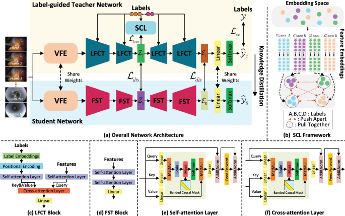

# Label-Guided-Teacher-for-Surgical-Phase-Recognition-via-Knowledge-Distillation

## Introduction
The Pytorch implementation for our paper 'Label-Guided-Teacher-for-Surgical-Phase-Recognition-via-Knowledge-Distillation', accepted at International Conference on Medical Image Computing and Computer-Assisted Intervention(MICCAI2024).

In this work, we propose a novel label-guided teacher network for surgical phase
recognition based on knowledge distillation. We introduce label embedding-frame
feature cross-attention transformer and supervised contrastive learning to learn
a better label-guided teacher network,which can better integrate the label embedding with the frame feature.




## Citation
If this repository is useful for your research, please cite:
```
@inproceedings{guan2024label,
  title={Label-Guided Teacher for Surgical Phase Recognition via Knowledge Distillation},
  author={Guan, Jiale and Zou, Xiaoyang and Tao, Rong and Zheng, Guoyan},
  booktitle={International Conference on Medical Image Computing and Computer-Assisted Intervention},
  pages={349--358},
  year={2024},
  organization={Springer}
}

```
## Acknowledgement
Some of code in this work is modified from [Trans-SVNet](https://github.com/YuemingJin/Trans-SVNet_Journal).
